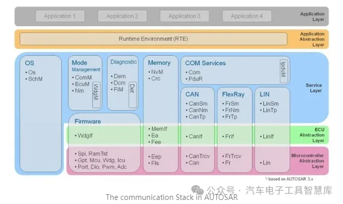

# Autosar Com Stack

com stack 分布在autosar基础软件层的三个子层中：

	服务层
	ECU抽象层
	MCAL (微控制器抽象层)

com stack 所包含的模块有

	com(服务层)
	PDUR(服务层)
	Canif, Frif 等总线接口模块(ECU抽象层)
	外部总线驱动程序(ECU抽象层)
	内部总线驱动程序(MCAL层)

I-PDU, N-PDU, L-PDU

	I-PDU:交互层 PDU, ECU抽象层以上；
	N-PDU:网络层PDU, PDUR以下，通信驱动程序以上；
	L-PDU:通信硬件抽象层之下

